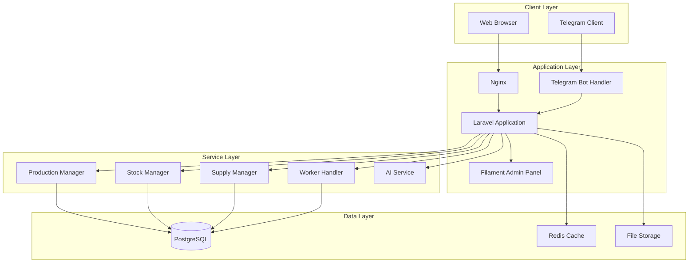

# PulBot ERP/CRM System

<p align="center">
  <strong>Enterprise Resource Planning & Customer Relationship Management</strong><br>
  <em>Advanced Multi-Tenant Manufacturing and Warehouse Management Platform</em>
</p>

<p align="center">
  
  
  
  
  
</p>

---

## Table of Contents

- [Overview](#overview)
- [Key Features](#key-features)
- [System Architecture](#system-architecture)
- [Technology Stack](#technology-stack)
- [Prerequisites](#prerequisites)
- [Installation](#installation)
- [Configuration](#configuration)
- [Telegram Bot Integration](#telegram-bot-integration)
- [Usage](#usage)
- [Module Documentation](#module-documentation)
- [Security](#security)
- [Maintenance](#maintenance)
- [Contributing](#contributing)
- [License](#license)

---

## Overview

**PulBot** is an enterprise-grade, multi-tenant ERP/CRM system specifically engineered for manufacturing and warehouse operations. Built on Laravel 10 and enhanced with Filament 3 administration framework, the platform delivers comprehensive production management, inventory control, and supply chain coordination through both web interface and integrated Telegram bot.

### Target Industries

- Manufacturing facilities
- Warehouse operations
- Distribution centers
- Multi-location enterprises
- Production-driven organizations

### Core Differentiators

- **Multi-Tenant Architecture**: Complete organizational isolation with role-based access control
- **Telegram Bot Integration**: Full workflow management through Telegram messenger
- **Real-Time Production Tracking**: Live monitoring of production orders and work station performance
- **Advanced Inventory Management**: Multi-warehouse inventory with real-time transaction tracking
- **Supply Chain Coordination**: End-to-end supplier and procurement management

---

## Key Features

### 📦 Inventory Management
- **Multi-Warehouse Support**: Manage inventory across multiple physical locations
- **Storage Location Tracking**: Granular location management (floor, row, column, shelf)
- **Real-Time Transactions**: Live tracking of all inventory movements
- **Automated Reordering**: Smart inventory level monitoring and alerts
- **Product Categorization**: Hierarchical product organization with custom attributes

### 🏭 Production Management
- **Production Templates**: Reusable production workflows and recipes
- **Production Orders**: Complete order lifecycle management
- **Work Station Management**: Performance tracking and capacity planning
- **Step-by-Step Execution**: Granular production step tracking with approvals
- **Production Groups**: Batch processing and grouped order management
- **Quality Control**: Multi-level approval workflow with production manager oversight

### 🚚 Supply Chain
- **Supplier Management**: Comprehensive supplier database with product catalogs
- **Supply Orders**: Purchase order creation and tracking
- **Multi-Step Receiving**: Structured receiving workflow with location assignment
- **Price Management**: Historical pricing and currency support
- **Supplier Performance**: Delivery tracking and supplier evaluation

### 👥 Organization & User Management
- **Multi-Tenant Organizations**: Complete data isolation between organizations
- **Role-Based Access Control**: 10+ predefined roles with granular permissions
  - Senior Production Manager
  - Production Manager
  - Senior Supply Manager
  - Supply Manager
  - Senior Stock Manager
  - Stock Manager
  - Planning Manager
  - Allocation Manager
  - Work Station Worker
  - AI Assistant
  - Codex (Self-improving agent)
- **Organization Partners**: Inter-organization relationships and collaboration
- **Warehouse Assignment**: User-to-warehouse mapping for location-specific operations

### 💬 Telegram Bot
- **Authentication**: Secure auth code-based user authentication
- **Role-Specific Handlers**: Customized interfaces per user role
- **Real-Time Notifications**: Instant updates on production status, orders, and tasks
- **Mobile Workflow**: Complete workflow management from mobile devices
- **Long Polling**: Reliable message processing with automatic recovery

### 📊 Performance & Analytics
- **Work Station Performance**: Real-time efficiency metrics
- **Production Rate Tracking**: Historical performance analysis
- **Inventory Turnover**: Stock movement analytics
- **Supply Chain Metrics**: Supplier performance and delivery tracking

---

## System Architecture



### Component Overview

**Web Layer**
- **Nginx**: High-performance reverse proxy and static file serving
- **Laravel PHP-FPM**: Application server running on PHP 8.1+

**Application Core**
- **Filament 3**: Modern TALL-stack admin panel (Tailwind, Alpine.js, Laravel, Livewire)
- **Livewire**: Real-time, reactive components without JavaScript frameworks
- **Laravel 10**: Robust MVC framework with extensive ecosystem

**Telegram Integration**
- **Long Polling Bot**: Persistent connection for real-time message processing
- **Handler Factory**: Role-based handler instantiation
- **Cache Layer**: Session and state management for bot conversations

**Database**
- **PostgreSQL 17**: ACID-compliant relational database
- **95 Migrations**: Comprehensive schema with full referential integrity
- **Indexed Queries**: Optimized for multi-tenant performance

---

## Technology Stack

### Backend
- **Framework**: Laravel 10.x
- **Language**: PHP 8.1+
- **Admin Panel**: Filament 3.2
- **Authentication**: Laravel Sanctum
- **Real-time**: Livewire 3.x

### Frontend
- **CSS Framework**: Tailwind CSS
- **JavaScript**: Alpine.js
- **Icons**: Heroicons
- **Components**: Filament Blade components

### Database & Cache
- **Primary Database**: PostgreSQL 17
- **Cache**: Redis 7.0 / File-based fallback
- **ORM**: Eloquent

### DevOps
- **Containerization**: Docker + Docker Compose
- **Web Server**: Nginx 1.26
- **Process Manager**: PHP-FPM
- **Database Admin**: pgAdmin 4

### APIs & Integration
- **Telegram Bot API**: Long polling bot implementation
- **Guzzle HTTP**: HTTP client for external APIs
- **Predis**: Redis client library

---

## Prerequisites

### System Requirements

**Operating System**
- Linux (Ubuntu 20.04+ recommended)
- macOS 10.15+
- Windows 10/11 with WSL2

**Software**
- Docker 20.10+
- Docker Compose 2.0+
- Make (GNU Make 4.0+)
- Git 2.20+

**Hardware (Production)**
- CPU: 4+ cores
- RAM: 8GB minimum, 16GB recommended
- Storage: 50GB+ SSD
- Network: 100Mbps+ connection

**Hardware (Development)**
- CPU: 2+ cores
- RAM: 4GB minimum
- Storage: 20GB+ available

---

## Installation

### Quick Start (Production)

```bash
# Clone the repository
git clone https://github.com/yourusername/pulbot-erp.git
cd pulbot-erp

# Run full deployment
make full
```

This single command will:
1. Prepare environment configuration
2. Build Docker images
3. Start all services
4. Install PHP dependencies
5. Generate application key
6. Run database migrations
7. Seed initial data
8. Start Codex agent (if configured)

### Step-by-Step Installation

#### 1. Clone and Configure

```bash
# Clone repository
git clone https://github.com/yourusername/pulbot-erp.git
cd pulbot-erp

# Create environment file
cp .env.example .env

# Edit configuration
nano .env
```

#### 2. Configure Environment

**Required Variables:**

```env
# Application
APP_NAME=PulBot
APP_ENV=production
APP_URL=https://your-domain.com
APP_PORT=8080

# Database
DB_CONNECTION=pgsql
DB_HOST=db
DB_PORT=5432
DB_DATABASE=pulbot_db
DB_USERNAME=pulbot_user
DB_PASSWORD=your_secure_password

# Telegram Bot
TELEGRAM_BOT_TOKEN=your_telegram_bot_token_here
TELEGRAM_WEBHOOK_SECRET=your_webhook_secret

# Admin Credentials
ADMIN_EMAIL=admin@yourdomain.com
ADMIN_PASSWORD=secure_admin_password
```

#### 3. Build and Deploy

```bash
# Build Docker images
make compose-build-prod

# Start services
make compose-up-prod

# Initialize application
make init-prod

# Check service status
docker ps
```

#### 4. Verify Installation

```bash
# Check application health
curl http://localhost:8080

# Verify database connection
docker exec pulbot-php php artisan migrate:status

# Test Telegram bot
make bot
```

### Development Installation

```bash
# Start development environment
make compose-up

# Install dependencies
make composer install

# Generate application key
make artisan key:generate

# Run migrations
make artisan migrate

# Seed database
make artisan db:seed

# Start development server
# Application available at http://localhost:8080
```

---

## Configuration

### Environment Variables

#### Core Application

| Variable | Default | Description |
|----------|---------|-------------|
| `APP_NAME` | PulBot | Application name |
| `APP_ENV` | local | Environment (local/production) |
| `APP_DEBUG` | false | Debug mode (never true in production) |
| `APP_URL` | http://localhost | Application base URL |
| `APP_KEY` | - | Encryption key (auto-generated) |

#### Database

| Variable | Default | Description |
|----------|---------|-------------|
| `DB_CONNECTION` | pgsql | Database driver |
| `DB_HOST` | db | Database host |
| `DB_PORT` | 5432 | Database port |
| `DB_DATABASE` | pulbot_db | Database name |
| `DB_USERNAME` | pulbot_user | Database user |
| `DB_PASSWORD` | - | Database password |

#### Telegram Bot

| Variable | Default | Description |
|----------|---------|-------------|
| `TELEGRAM_BOT_TOKEN` | - | Telegram Bot API token |
| `TELEGRAM_TEST_CHAT_ID` | - | Test chat ID for development |
| `TELEGRAM_WEBHOOK_SECRET` | - | Webhook authentication secret |
| `TELEGRAM_HTTP_TIMEOUT` | 10 | HTTP request timeout (seconds) |
| `TELEGRAM_HTTP_CONNECT_TIMEOUT` | 5 | Connection timeout (seconds) |

#### Cache & Queue

| Variable | Default | Description |
|----------|---------|-------------|
| `CACHE_DRIVER` | file | Cache driver (file/redis) |
| `REDIS_HOST` | redis | Redis server host |
| `REDIS_PORT` | 6379 | Redis server port |
| `QUEUE_CONNECTION` | sync | Queue driver |
| `BOT_QUEUE` | true | Enable queue for bot processing |

#### Optional Services

| Variable | Default | Description |
|----------|---------|-------------|
| `OPENAI_API_KEY` | - | OpenAI API key (AI features) |
| `OPENAI_MODEL` | gpt-4o | OpenAI model to use |
| `AI_SERVICE_URL` | http://ai:8000 | AI service endpoint |
| `GH_TOKEN` | - | GitHub token (for Codex) |

### Port Configuration

| Service | Port | Description |
|---------|------|-------------|
| Application | 8080 | Main web interface |
| PostgreSQL | 5432 | Database (internal) |
| pgAdmin | 5050 | Database administration |
| Redis | 6379 | Cache server (internal) |
| AI Service | 8000 | AI assistant (internal) |

---

## Telegram Bot Integration

### Overview

The Telegram bot provides a complete mobile interface for workflow management, allowing users to perform critical operations without accessing the web interface.

### Bot Setup

#### 1. Create Telegram Bot

```bash
# Talk to @BotFather on Telegram
/newbot

# Follow prompts and receive token
# Format: 123456789:ABCdefGHIjklMNOpqrsTUVwxyz
```

#### 2. Configure Bot

```bash
# Add token to .env
TELEGRAM_BOT_TOKEN=your_bot_token_here

# Restart services
make restart
```

#### 3. Start Bot

```bash
# Start bot in foreground
make bot

# Or run in background
docker exec -d pulbot-php php artisan bot:run
```

### Authentication Flow

1. **Obtain Auth Code**
   - Login to web interface (http://localhost:8080)
   - Navigate to Profile → Auth Code
   - Note the 6-digit code

2. **Login via Telegram**
   - Send `/login` to the bot
   - Enter your 6-digit auth code
   - Receive confirmation message

3. **Start Using Bot**
   - Send `/start` to access main menu
   - Menu options are role-specific

### Role-Specific Features

#### Production Manager
- View active production orders
- Approve/reject production steps
- Monitor work station performance
- Assign tasks to workers
- Receive production alerts

#### Supply Manager
- Create supply orders
- Track deliveries
- Manage supplier communications
- Approve purchase requests
- Monitor inventory levels

#### Stock Manager
- View inventory levels
- Process incoming shipments
- Assign storage locations
- Track inventory transactions
- Generate inventory reports

#### Work Station Worker
- View assigned tasks
- Start/complete production steps
- Report quantities produced
- Request materials
- View work instructions

### Bot Commands

| Command | Description | Available To |
|---------|-------------|--------------|
| `/start` | Show main menu | All authenticated users |
| `/login` | Authenticate with auth code | Unauthenticated users |
| `/help` | Show available commands | All users |
| `/status` | Show current tasks/orders | All authenticated users |
| `/profile` | Show user profile | All authenticated users |

### Notifications

Users automatically receive notifications for:
- Task assignments
- Production order status changes
- Approval requests
- Inventory alerts
- System announcements

---

## Usage

### Web Administration

#### First Login

1. Navigate to `http://localhost:8080`
2. Login with admin credentials:
   - Email: `admin@pulbot.local`
   - Password: `admin123` (change immediately)
3. Navigate to Profile → Change Password

#### Creating Organizations

1. Navigate to **Organizations**
2. Click **Create Organization**
3. Fill in details:
   - Organization name
   - Code (unique identifier)
   - Status (Active/Inactive)
4. Save

#### Managing Users

1. Navigate to **Users**
2. Click **Create User**
3. Configure:
   - Name and email
   - Organization assignment
   - Role selection
   - Warehouse assignment
4. Note auto-generated auth code for Telegram login

#### Setting Up Production

**Create Product Categories**
1. Navigate to **Product Categories**
2. Define measure units (kg, pcs, meters, etc.)
3. Set up category hierarchy

**Add Products**
1. Navigate to **Products**
2. Create products with:
   - Name and SKU
   - Category assignment
   - Unit cost
   - Work station (if produced)

**Configure Work Stations**
1. Navigate to **Work Stations**
2. Set up production stations:
   - Station name and code
   - Product category
   - Performance metrics
   - Assigned production manager

**Create Production Templates**
1. Navigate to **Production Templates**
2. Define workflow:
   - Template name
   - Multiple production steps
   - Input/output products per step
   - Work station assignments

#### Managing Production Orders

1. Navigate to **Production Orders**
2. Click **Create Order**
3. Configure:
   - Select production template
   - Set quantity required
   - Assign agent (customer)
   - Choose warehouse
4. Confirm order to activate
5. Track progress through status updates

#### Supply Chain Management

**Add Suppliers**
1. Navigate to **Organization Partners**
2. Create supplier profile
3. Add supplier products with pricing

**Create Supply Orders**
1. Navigate to **Supply Orders**
2. Create new order:
   - Select supplier
   - Add products and quantities
   - Set delivery warehouse
3. Process delivery when received
4. Assign storage locations

---

## Module Documentation

### Inventory Module

**Tables**
- `inventories`: Stock levels per product/warehouse
- `inventory_transactions`: All inventory movements
- `storage_locations`: Physical storage mapping

**Features**
- Real-time stock tracking
- Multi-warehouse support
- Location-based inventory
- Transaction history
- Automated alerts

### Production Module

**Tables**
- `prod_templates`: Reusable production workflows
- `prod_orders`: Active and historical orders
- `prod_order_steps`: Step-by-step execution tracking
- `prod_order_step_executions`: Worker execution records
- `work_stations`: Production stations
- `performance_rates`: Historical performance data

**Workflow**
1. Template defines production process
2. Order created from template
3. Steps assigned to work stations
4. Workers execute and report
5. Managers approve each step
6. Order marked complete

### Supply Chain Module

**Tables**
- `supply_orders`: Purchase orders
- `supply_order_products`: Line items
- `supply_order_steps`: Receiving workflow
- `supply_order_locations`: Storage assignments
- `organization_partners`: Suppliers
- `organization_partner_products`: Supplier catalogs

**Procurement Workflow**
1. Create supply order
2. Submit to supplier
3. Track delivery status
4. Process receiving steps
5. Assign storage locations
6. Update inventory

---

## Security

### Authentication

- **Web**: Laravel session-based authentication
- **API**: Laravel Sanctum token authentication  
- **Telegram**: Auth code authentication with expiry
- **Password**: Bcrypt hashing with salt

### Authorization

- **Multi-Tenant**: Organization-based data isolation
- **RBAC**: Role-based access control
- **Policies**: Laravel policy-based authorization
- **Scopes**: Global scopes for automatic filtering

### Data Protection

- **Encryption**: AES-256 for sensitive data
- **SSL/TLS**: Required for production deployment
- **CSRF**: Protection on all state-changing requests
- **XSS**: Automatic escaping in Blade templates
- **SQL Injection**: Prepared statements via Eloquent

### Best Practices

1. **Change default credentials** immediately
2. **Use strong passwords** (16+ characters)
3. **Enable HTTPS** in production
4. **Regular backups** of database and files
5. **Update dependencies** monthly
6. **Monitor logs** for suspicious activity
7. **Rotate API keys** quarterly
8. **Limit IP access** when possible

### Vulnerability Reporting

Please report security vulnerabilities to: security@yourorganization.com

**Do not** open public issues for security vulnerabilities.

---

## Maintenance

### Backup Procedures

**Database Backup**
```bash
# Manual backup
make backup

# Scheduled backup (cron)
0 2 * * * cd /path/to/pulbot && make backup
```

**File Backup**
```bash
# Backup storage directory
tar -czf storage-backup-$(date +%Y%m%d).tar.gz storage/

# Backup environment
cp .env .env.backup
```

### Updates

**Application Updates**
```bash
# Pull latest code
git pull origin main

# Update dependencies
make composer update

# Run migrations
make artisan migrate

# Clear cache
make artisan cache:clear
make artisan config:clear
make artisan view:clear

# Restart services
make restart
```

**Docker Image Updates**
```bash
# Rebuild images
make build

# Push to registry (if using)
make push

# Deploy updated images
make compose-up-prod
```

### Monitoring

**Service Health**
```bash
# Check all containers
docker ps

# View logs
docker logs pulbot-php
docker logs pulbot-nginx
docker logs pulbot-db

# Resource usage
docker stats
```

**Application Logs**
```bash
# Laravel logs
tail -f storage/logs/laravel.log

# Nginx access logs
docker logs pulbot-nginx

# PostgreSQL logs
docker logs pulbot-db
```

### Troubleshooting

**Bot Not Responding**
```bash
# Check bot process
docker exec pulbot-php ps aux | grep bot

# Restart bot
docker exec -d pulbot-php php artisan bot:run

# Check Telegram token
echo $TELEGRAM_BOT_TOKEN
```

**Database Connection Issues**
```bash
# Test database connectivity
docker exec pulbot-php php artisan migrate:status

# Check database logs
docker logs pulbot-db

# Verify credentials in .env
```

**Permission Issues**
```bash
# Fix storage permissions
docker exec -u root pulbot-php chown -R www-data:www-data storage bootstrap/cache

# Fix vendor permissions
docker exec -u root pulbot-php chown -R developer:developer vendor
```

---

## Contributing

We welcome contributions from the community! Please read our contributing guidelines before submitting pull requests.

### Development Workflow

1. Fork the repository
2. Create a feature branch (`git checkout -b feature/amazing-feature`)
3. Commit changes (`git commit -m 'Add amazing feature'`)
4. Push to branch (`git push origin feature/amazing-feature`)
5. Open a Pull Request

### Code Standards

- **PSR-12**: PHP coding standards
- **Laravel Best Practices**: Follow Laravel conventions
- **Comments**: Document complex logic
- **Tests**: Include tests for new features
- **Migrations**: Reversible migrations only

### Testing

```bash
# Run test suite
make artisan test

# Run specific test
make artisan test --filter=UserTest

# Generate coverage report
make artisan test --coverage
```

---

## License

This project is proprietary software. All rights reserved.

**Copyright © 2025 PulBot Development Team**

Unauthorized copying, modification, distribution, or use of this software, via any medium, is strictly prohibited without explicit written permission from the copyright holder.

---

## Support

For technical support, please contact:

- **Email**: support@yourorganization.com
- **Documentation**: https://docs.yourorganization.com
- **Issue Tracker**: https://github.com/yourorganization/pulbot/issues

---

## Acknowledgments

Built with:
- [Laravel](https://laravel.com) - The PHP Framework for Web Artisans
- [Filament](https://filamentphp.com) - Beautiful admin panels, fast
- [PostgreSQL](https://www.postgresql.org) - The World's Most Advanced Open Source Database
- [Telegram Bot API](https://core.telegram.org/bots/api) - Telegram Bot Platform

---

<p align="center">
  <strong>PulBot ERP/CRM</strong><br>
  <em>Engineered for Excellence in Manufacturing Management</em>
</p>
